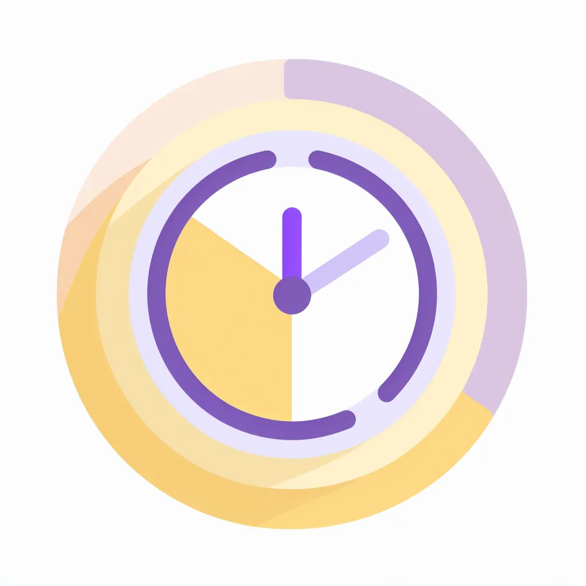

# 🗂️ Vdosku - Android Application 

  

**Vdosku** — это Android-приложение для удобного управления расписанием и заметками. Легкий интерфейс, современные технологии и оффлайн-режим делают его идеальным помощником для студентов!  

---

## 🚀 Особенности  

✨ **Простой интерфейс**:  
- Просматривайте расписание на неделю с интуитивно понятным дизайном.
- Быстрая навигация между неделями.
- Встроенный календарь

📝 **Умные заметки**:  
- Добавляйте заметки к занятиям
- Просматривайте их в контексте расписания.

🌐 **Синхронизация с RestAPI**:  
- Загружайте актуальное расписание и сохраняйте его для работы в оффлайн-режиме.  

🎨 **Современный дизайн**:  
- Построено на Jetpack Compose с элементами Material3 для минималистичного и приятного UI.
- Разработано по созданному в Figma дизайн-макету

---

## 🛠️ Используемые технологии  

<table align="center">
  <tr>
    <td align="center" style="padding: 10px;">
       
      <b>Kotlin</b>
    </td>
    <td align="center" style="padding: 10px;">
       
      <b>Jetpack Compose</b>
    </td>
    <td align="center" style="padding: 10px;">
      <b>Dagger Hilt</b>
    </td>
    <td align="center" style="padding: 10px;">
      <b>Retrofit2 + OkHttp3</b>
    </td>
    <td align="center" style="padding: 10px;">
       
      <b>Material Design</b>
    </td>
    <td align="center" style="padding: 10px;">
       
      <b>Figma</b>
    </td>
  </tr>
</table>

## 📸 Скриншоты  

| Расписание                          | Добавление заметки                  |  
|-------------------------------------|-------------------------------------|  
|  |  |  

---
